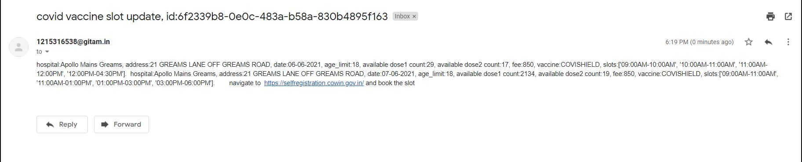

# Vaccination Slot Notifier

This application notifies via email when the slots are available for the particular pincode, age and slot number entered. 

## Steps to use
- clone the repo
    ```
    git clone https://github.com/MeghaShyam26/covid-slot-notifier.git
    ```
- install the requirements
    ```
    pip install -r requirements.txt
    ```
- Navigate to contants.py
    - Enter a valid email id which dosen't have mutli factor authentication in line 5
    - Enter a valid password in line 8
    - Enter the age you are looking for in line 12
    - Enter the slot number you are looking for in line 16
    - Enter the pincode required in the array in line 20 and append more if required
    - Enter the number of days you want to check for starting from today in line 26
    - Enter the peak hours where generally the slots release is expected in line 36 for start and 38 for end time in 24 hour format
    - If you want hit the url with less sleep time than mentioned then update the line 30 for peak time and 33 for non peak time
- Navigate to app.py
    - Enter a valid 'to' address in line 88
    - If the mail has to be sent to more than 1 then copy the line and paste it below and change the 'to' address
    - Change the port number if required in line 120
- Run the server
    - Go to the root directory of this folder where app.py is present and run this command
    ```
    python app.py
    ```
- navigate to chrome and enter the url obtained with 
    - '/notify' => to run make requests to the api and get notifications if the slot is open
    - '/stop' => to stop making requests to the api
- primariy between 2-6 pm is where the slots are being opened so definetly have the server and hit '/notify' endpoint for the same time.

## Sample output
